# [My Daily Dashboard](https://jacqueline-kraus.github.io/MS2-My-Daily-Dashboard/)

This project is a single webpage, which provides a dashboard with recommendations and information on a daily basis.

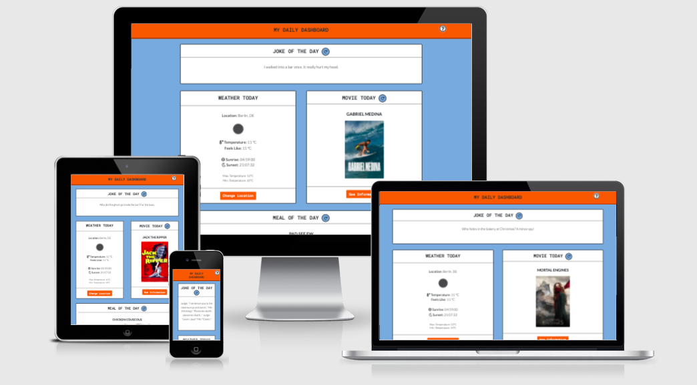
--- 
# Table of contents
- [UX](#ux)
    - [Website owner business goals](#website-owner-business-goals)
    - [User goals](#user-goals)
    - [User stories](#user-stories)
    - [Structure of the website](#structure-of-the-website)
    - [Wireframes](#wireframes)
    - [Surface](#surface)
- [Features](#features)
    - [Existing features](#existing-features)
    - [Features left to implement](#features-left-to-implement)
- [Technologies used](#technologies-used)
- [Code Validation](#code-validation)
- [Testing](#testing)
    - [Funcionality Testing](#functionality-testing)
    - [Compatibility Testing](#compatibility-testing)
    - [User stories testing](#user-stories-testing)
    - [Bugs and problems](#bugs-and-problems)
- [Deployment](#deployment)
- [Credits](#credits)

#  UX 

## Website owner business goals
- As the website owner, the goal is to provide a centralised dashboard with different information and recommendations for the day.

## User goals
- User is happy by reading daily a joke
- User can refresh to get another joke
- User is informed about the weather forecast daily
- User is able to change the location for the weather forecast
- User receives daily recommendation on what movie to watch
- User can read a short description of the movie or refresh to get another movie recommendation
- User receives daily recommendation on which meal to prepare
- User can read a description of ingredients and preparation manual for recommended meal
- User can refresh to get another meal recommendation
- User has everything within one dashboard
- User has the option to read a FAQ, if in doubt of how to use the dashboard

## User stories
### As a business owner:
- I want to give information and recommendation on a daily basis in form of a dashboard to have everything in one place
- I want to provide a clear, easy understandable dashboard with the option to refresh the items

### As a user:
- I want to be in a good mood by laughing about a joke
- I want to know the daily weather forecast
- If I change my location, I still want to know the daily weather forecast, but for the new location
- I want to have a recommendation on which movie I could watch
- I want to have a recommendation on what I could cook and eat
- If I don't like any of the recommendations given, I want to have a new recommendation
- I want all of this in one place without needing to open 4 different apps

## Structure of the website
The website is optimized for all devices and screen sizes (desktop, mobile and tablet). It is easy to understand and therefore user friendly designed. It has a clear structure of different elements, that one may need in their daily life. In the header of the page is a FAQ button, for explaining the website. For getting more information each element block has a button which opens a modal. The element blocks that are refreshable have also a button to refresh and get a new item.

## Wireframes
Wireframes can be found here: [WIREFRAMES](https://github.com/jacqueline-kraus/MS2-My-Daily-Dashboard/blob/main/readme-files/My_daily_dashboard.pdf)

## Surface
### Fonts
The 2 fonts used are Roboto Mono and Lato (by Google Fonts). Roboto Mono is used for all headlines and buttons. Lato is used for all other kinds of texts. As a backup I used everywhere "sans-serif".

### Colors
To visually appear comic-like I used mainly 2 colors:
- body and refresh button background-color: #7faddb
- header and button background-color: #ea632b
- other background-color (content blocks and modals): #fff
- color of font is everywhere black.

### Images
- I did not use any images except the ones provided by the different [APIs](#APIs)
- Icons used are provided by [https://fontawesome.com/](https://fontawesome.com/)

# Features

## Existing Features

### Joke of the day:
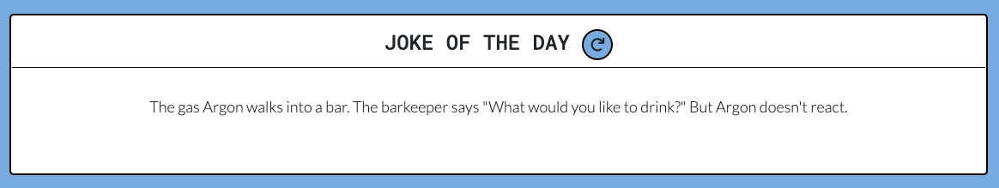
- Shows daily a new joke. By hitting the refresh button, the user can get another joke.

### Weather today:
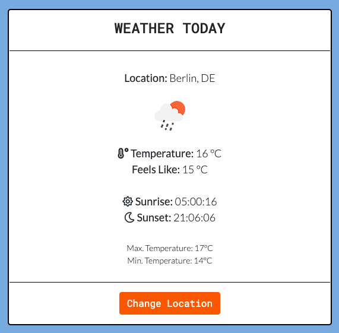
- Shows the weather, with the location detected automatically by [Geolocation DB](#APIs).

### Change Location for weather:
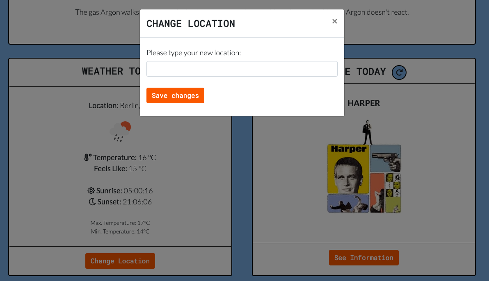
- In case the wrong location is detected, there is no location detected at all, or the user wants to change location manually, it is possible by clicking on the "Change location" button. This opens a modal with an input field for new location. By typing a new location and click (or press enter on the keyboard) on the button "Save changes", the weather for the new location will be shown.
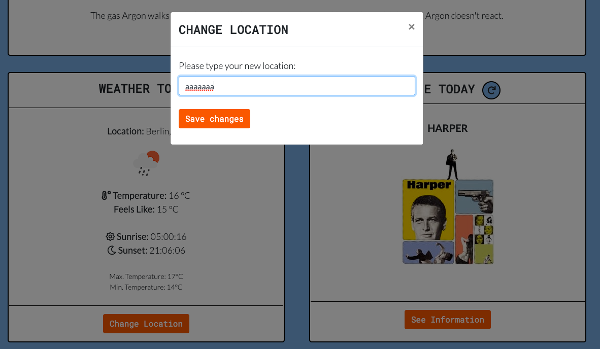
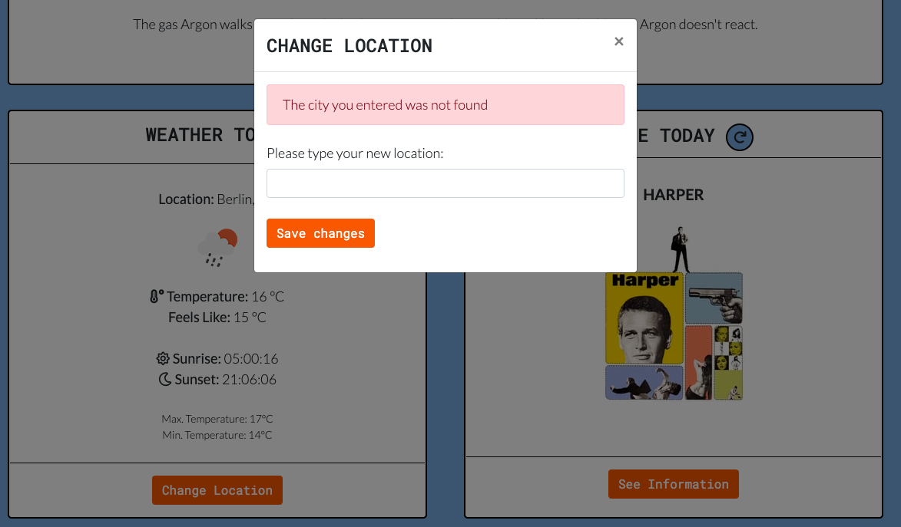
-  In case of a typo, the user sees an error message and can type again the new location. 

### Movie today:
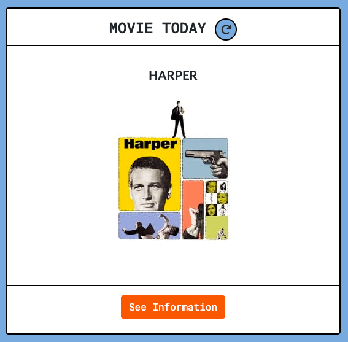
- The "Movie today" shows the movie title and the movie poster on the website.
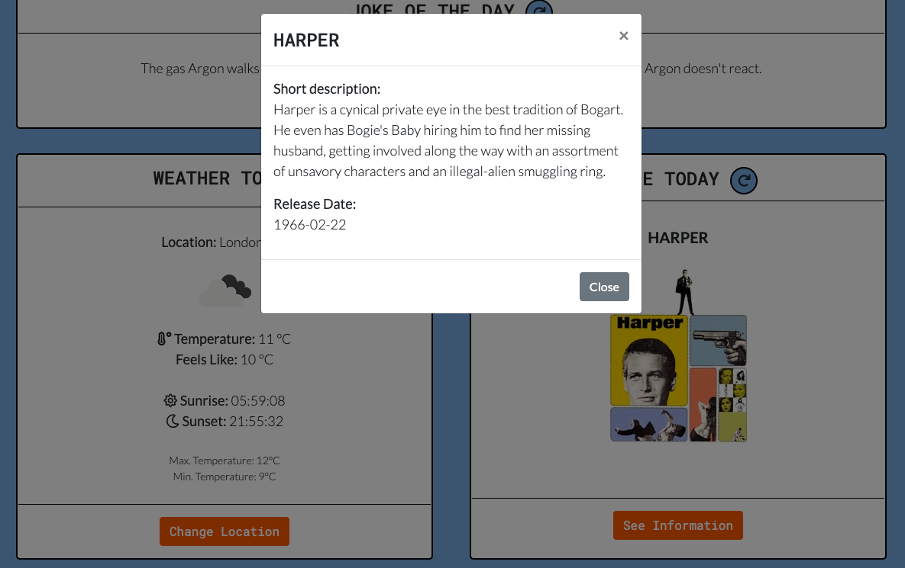
- By clicking on the button "See information" the user can read a short description of the movie and when the movie was first released.

### Meal of the day:
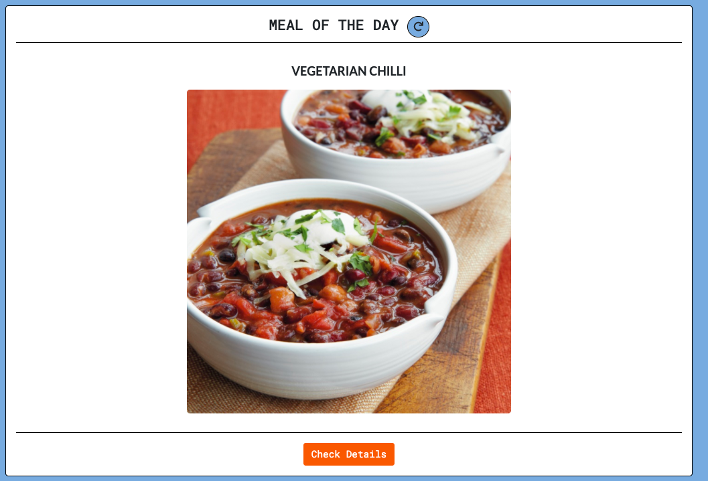
- The "Meal of the day" shows the name and an image of the meal.
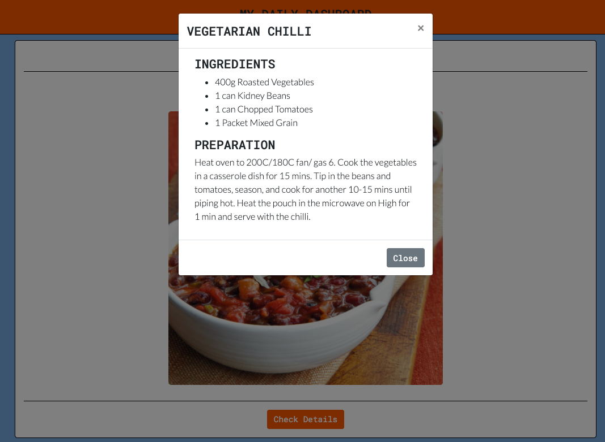
- By clicking on the button "Check details" the user can view the recipe (list of ingredients and preparation steps.)

### Refresh button:

- On the items "Joke", "Movie" and "Meal" the user can find a refresh button. By clicking this button, the item refreshes (a new item will be shown).

### FAQ:
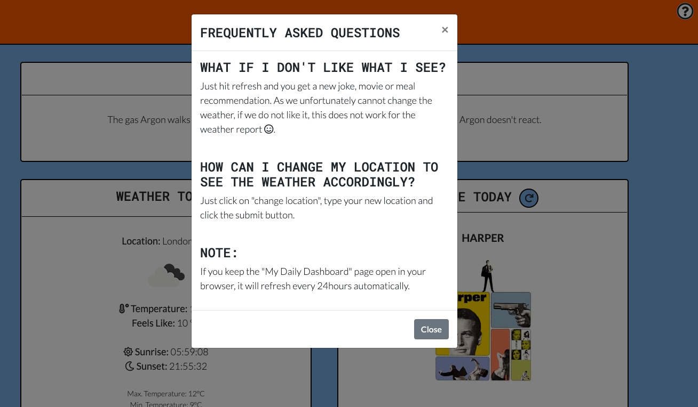
- By clicking on the "?" - icon on top corner right, a modal with frequently asked questions opens.

## Features left to implement:
- Joke/ Meal/ Movie: It is not possible yet to go back if hitting refresh by mistake. Especially for "Meal" this feature would be important for the future, as the ingredients list & preparation of recipe can be easily lost. First I would need to make sure each recipe has a valid URL (source), then I would integrate this URL or add a option to bookmark the URL.

- Weather report: At the moment with refreshing the page, the weather location is what the [Geolocation DB](#APIs) detects as your location. Ideally the website would remember the las used location and also show it after the next refresh. The way to implement this would be by using cookies or other possibilities to store data in the browser.

# Technologies used:
- [HTML](https://en.wikipedia.org/wiki/Hypertext_Markup_Language): for structuring the website
- [CSS](https://en.wikipedia.org/wiki/Cascading_Style_Sheets): to style the HTML code
- [JavaScript](https://en.wikipedia.org/wiki/JavaScript): for interactivity on the website
- [JQuery](https://jquery.com/): as a JavaScript library
- [Bootstrap v4.6](https://getbootstrap.com/): for responsiveness, additional style and modals
- [Popper.js](https://getbootstrap.com/docs/4.6/getting-started/introduction/): required by bootstrap for some functionality to work
- [Fontawesome](https://fontawesome.com/): as an icon library
- [Google Fonts](https://fonts.google.com/): as a font resource
- [Balsamiq](https://balsamiq.com/): for creating wireframes
- [Am I responsive?](http://ami.responsivedesign.is/): for checking responsiveness on different screen sizes and using the screenshot taken from there as a mockup for my projects readme.
- [Can I use?](https://caniuse.com/): to check browser support of fetch method
- [Comparium](https://front.comparium.app/livetesting): For live testing on different browsers
- [Realfavicongenerator](https://realfavicongenerator.net/): for generating the favicon

- [Github](https://github.com/): for hosting the projects repository and creating a live page with [Github pages](https://pages.github.com/)
- [Visual Studio Code](https://code.visualstudio.com/): as a IDE (Integrated Development Environment) for developing the project
- [Git](https://en.wikipedia.org/wiki/Git): for version control

### APIs:
- [JokeAPI](https://sv443.net/jokeapi/v2/): Free API to get jokes. Usable without API token. Rate Limiting: 120 calls per minute.
- [Geolocation DB](https://geolocation-db.com/): Free API to get geolocation of user. Usable without API key. No Rate limiting.
- [Openweathermap](https://openweathermap.org/current): Free API to get the current weather report. Need account to get API key. Rate Limiting: 60 calls per minute and 1,000,000 calls per month.
- [The Movie Database](https://developers.themoviedb.org/3/getting-started/introduction): Free API to get trending movies. Need account to get API key. Rate Limiting: No limit.
- [TheMealDB](https://www.themealdb.com/api.php): Free API to get random meal recipes. Usable with provided test API key. Rate Limiting: No limit of calls, but a limit of 100 items with the test API key.

# Code Validation
- [JShint](https://jshint.com/) to validate JavaScript code
- [W3 CSS Validator](https://jigsaw.w3.org/css-validator/) to validate CSS code
- [W3 HTML Validator](https://validator.w3.org/) to validate HTML code

# Testing

## Functionality testing
For testing responsiveness, styling and interactivity I used for the project [Chrome Developer Tools](https://developers.google.com/web/tools/chrome-devtools).

## Compatibility testing
The website was tested through virtual devices with Chrome Developer Tools.

Browsers tested: Google Chrome and Safari.

[Live testing with Comparium](https://front.comparium.app/livetesting)
- Windows 10 Chrome 89.0
- Windows 10 Firefox 85.0
- Windows 10 Edge 86.0
- Windows 10 Opera 74.0
- Linux Firefox 81.0
- Linux Chrome 87.0
- Linux Opera 72.0

Tested locally: 
- MacOs Catalina Google Chrome Version 90.0.4430.212 (Official Build) (x86_64)
- MacOs Catalina Safari Version 13.1.1 (15609.2.9.1.2)

The website was tested on following hardware devices:
- Macbook Air with MacOs Catalina (13-inch, 2017)
- Macbook Pro with MacOs Catalina (Retina, 15-inch, Mid 2015)
- Huawei P30 Pro with Android 10
- Google Pixel 4a (5G) with Android 11
- Microsoft Surface 7 Pro with Windows 10

Testing if fetch method is supported by all browsers with [https://caniuse.com/](https://caniuse.com/)
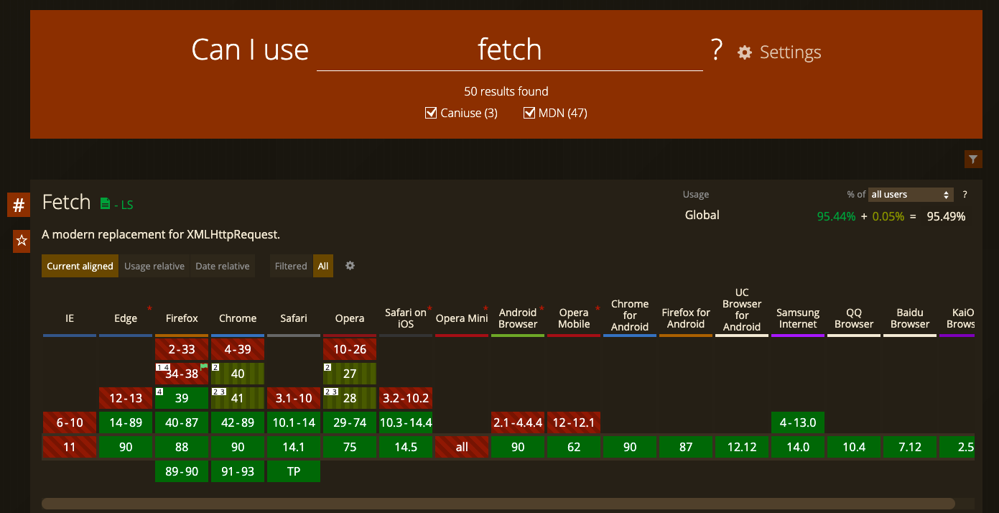

## Performance testing with [Lighthouse](https://developers.google.com/web/tools/lighthouse)

Overall Scores:

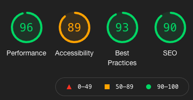

Accessibility score (needs improvment):

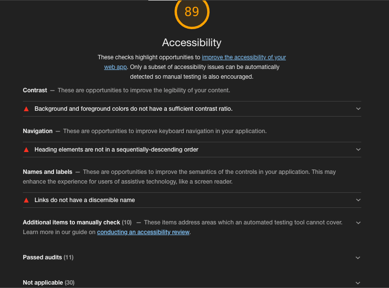

## User stories testing
### As a business owner:
- I want to give information and recommendation on a daily basis in form of a dashboard to have everything in one place
    > User can laugh about a joke, see the weather report, finds a movie recommendation and a meal recommendation for the day.

- I want to provide a clear, easy understandable dashboard with the option to refresh the items
    > User can find each item easily and is able to refresh the refreshable items (joke, movie, meal), if needed.

### As a user:
- I want to be in a good mood by laughing about a joke
    > The user can laugh about at least one joke a day.
- I want to know the daily weather forecast
    > The user can find the daily weather report for his/her location.
- If I change my location, I still want to know the daily weather forecast, but for the new location
    > By clicking on the button "change location", typing a new location and click on "save changes" the user is able to change his/her location.
- I want to have a recommendation on which movie I could watch
    > The user finds at least one recommendation for a movie to watch per day.
- I want to have a recommendation on what I could cook and eat
    > The user finds at least one meal recommendation per day including an ingredients list and preparation steps.
- If I don't like any of the recommendations given, I want to have a new recommendation
    > The user can do that by clicking on the refresh button, which is next to the headline of each item (except the weather report).
- I want all of this in one place without needing to open 4 different apps
    > The user finds all recommendations and information on one single page.

## Bugs and problems 
- [JokeAPI](https://sv443.net/jokeapi/v2/): while developing the website, the JokeAPI had several times very low Uptime. So when refreshing, there wasn't shown any joke at all anymore. There is nothing I could do about it than wait for the API to work again. That lead me to implement default texts (e.g. "Sorry xxx could not be loaded")for all elements which are automatically filled with API data.

- [Geolocation DB](https://geolocation-db.com/): Does not always show the exact geolocation. I included an alert that is shown if the location could not be detected at all when entering the page. If there is a location shown, but it is not the correct one, the user has the option to change manually to the right location.

- [TMDB API](https://developers.themoviedb.org/3/getting-started/introduction): While testing, there were some movies shown, which would fall in the category "adult movies". However, the JSON object "adult" showed in all cases "false". I could not find any other way to use as a filter for not showing adult movies, so it is still possible that they are shown as well.

- Movie block: The title of the movie often took many lines (especially a problem on mobile). This led to breaking the design (image was pushed down into another element). If changing the height of the whole container, this would lead to misalignment between the "weather" block and the "movie" block. As a solution I trimmed the title via JavaScript code, so that only 30 characters (minus 3 for "...") could be shown. Like this there is no problem in design, the whole title can be seen when hovering on it or when opening the modal.

- Style on MacOs Catalina Safari Version 13.1.1 (15609.2.9.1.2): The FAQ button style is not shown correctly.
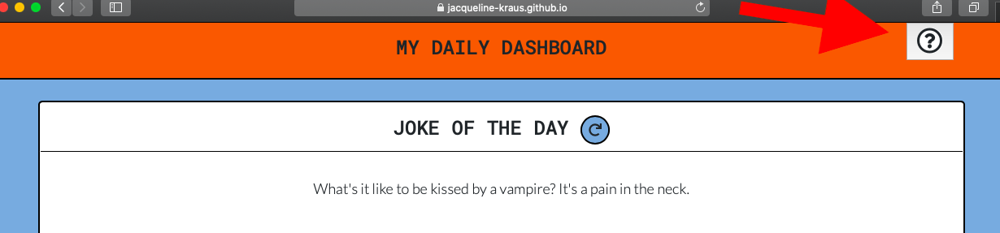

# Deployment
## [Github pages](https://docs.github.com/en/github/working-with-github-pages/configuring-a-publishing-source-for-your-github-pages-site)
1. Go to repository 
2. Click on "Settings"
3. Scroll on the lefthand menu until the section "Pages". This will open the section "Github Pages"
4. Select on the "source" dropdown menu the "main branch" option
5. A success message (in green) appears and shows you the link for your live preview page in Github Pages.

## [Local deployment](https://docs.github.com/en/github/creating-cloning-and-archiving-repositories/cloning-a-repository)
1. Go to repository
2. Click on the button "code"
3. Select the "HTTPS" option.
4. Copy the URL presented
5. Open your Terminal
6. Create a directory for storing this repository
7. Type "git clone" and paste the URL in that you previously copied
8. Press enter to create local clone repository

# Credits

## Content
- [JokeAPI](https://sv443.net/jokeapi/v2/): For the jokes
- [Geolocation DB](https://geolocation-db.com/): For the geolocation detection
- [Openweathermap](https://openweathermap.org/current): For the current weather report
- [The Movie Database](https://developers.themoviedb.org/3/getting-started/introduction): For the movie recommendations
- [TheMealDB](https://www.themealdb.com/api.php): For the meal recommendations

## Problem solving helpers
- [w3schools.com](https://www.w3schools.com/)
- [MDN Web Docs](https://developer.mozilla.org/en-US/docs/Learn)
- [stackoverflow](https://stackoverflow.com/)
- [Bootstrap documentation](https://getbootstrap.com/docs/4.6/getting-started/introduction/)

## Code
- [Bootstrap](https://getbootstrap.com/): for grid, form and styling of the website
- [Google Fonts](https://fonts.google.com/): for the fonts used
- [Fontawesome](https://fontawesome.com/): for the icons
- [Stackoverflow](https://stackoverflow.com/questions/28952550/how-to-convert-utc-timestamp-only-into-local-time-on-the-web-with-javascript): to convert UTC timestamp data into local time
- [Getbutterfly.com](https://getbutterfly.com/generate-html-list-from-javascript-array/): generating a html list from a JavaScript array.
- [Stackoverflow](https://stackoverflow.com/questions/784539/how-do-i-replace-all-line-breaks-in-a-string-with-br-elements): To get code that works as a line break in html
- [Stackoverflow](https://stackoverflow.com/questions/7463658/how-to-trim-a-string-to-n-chars-in-javascript): to trim movie title for mobile optimization

## Acknowledgments
- A big thank you to my mentor [Adeye Adegbenga](https://github.com/deye9) for helping me finding bugs and giving me directions on how to solve them.
- Also thank you so much [Ricardo Fiorani](https://github.com/ricardofiorani) for reviewing the code and finding typos!
- Another thank you goes out to the Code Institute Slack Community for giving me valuable feedback on my project!